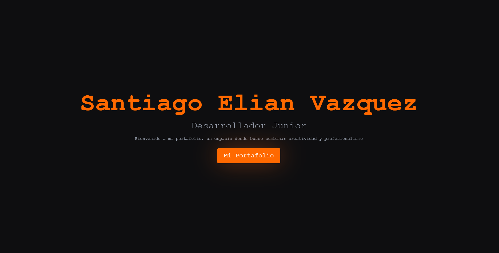

# AIM://Portfolio — Santiago Elian Vazquez

Portfolio interactivo inspirado en CS2. Refleja mi creatividad y ganas de seguir aprendiendo.



## 🎮 Demo en vivo

[portafolio-santiago-vazquez-lw3fz4rlx.vercel.app](https://portafolio-santiago-vazquez-lw3fz4rlx.vercel.app)

## ✨ Features

- Personaje TerrorCS que patrulla la pantalla
- Mira custom que reemplaza el cursor
- Disparos con sonido de AK47 real
- KillFeed estilo CS2 al impactar un botón
- Sonido de headshot al navegar
- Navegación entre secciones sin tocar un solo link

## 🛠️ Stack

- **React + Vite**
- **Tailwind CSS**
- **KAPLAY** — game engine para canvas
- **React Router**

## 🚀 Correr localmente

```bash
npm install
npm run dev
```

Abre [http://localhost:5173](http://localhost:5173) en el browser.

## 👤 Autor

Santiago Elian Vazquez — [GitHub](https://github.com/SantiagoVazquez21)
